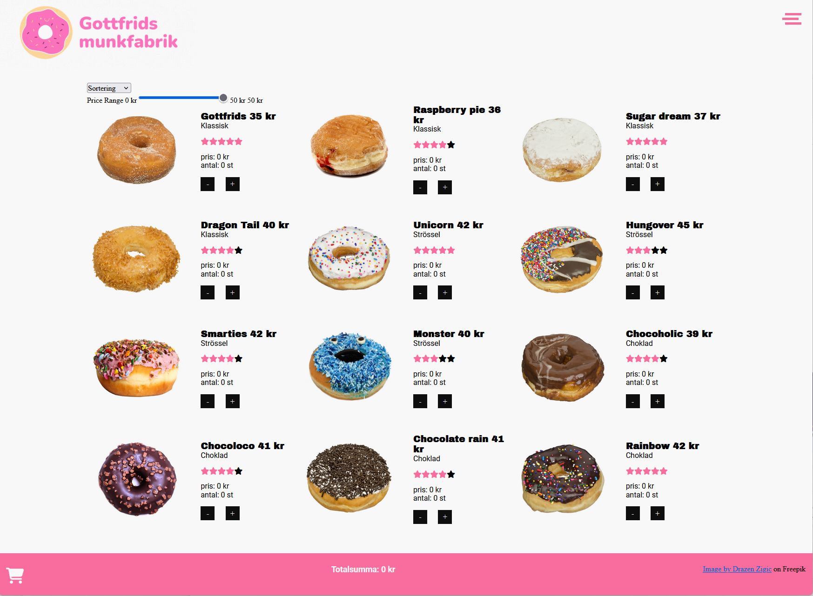
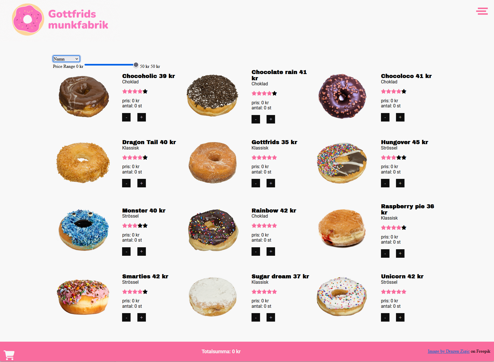
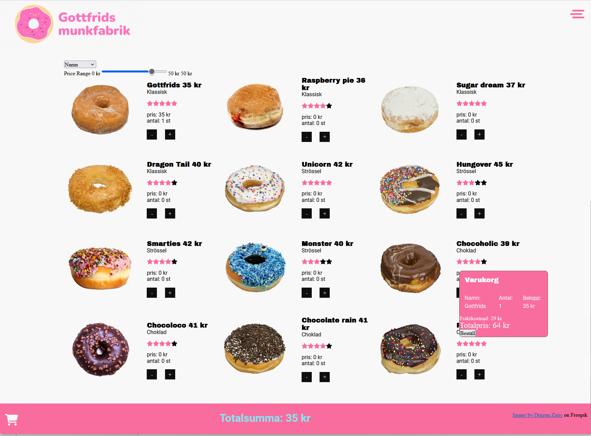
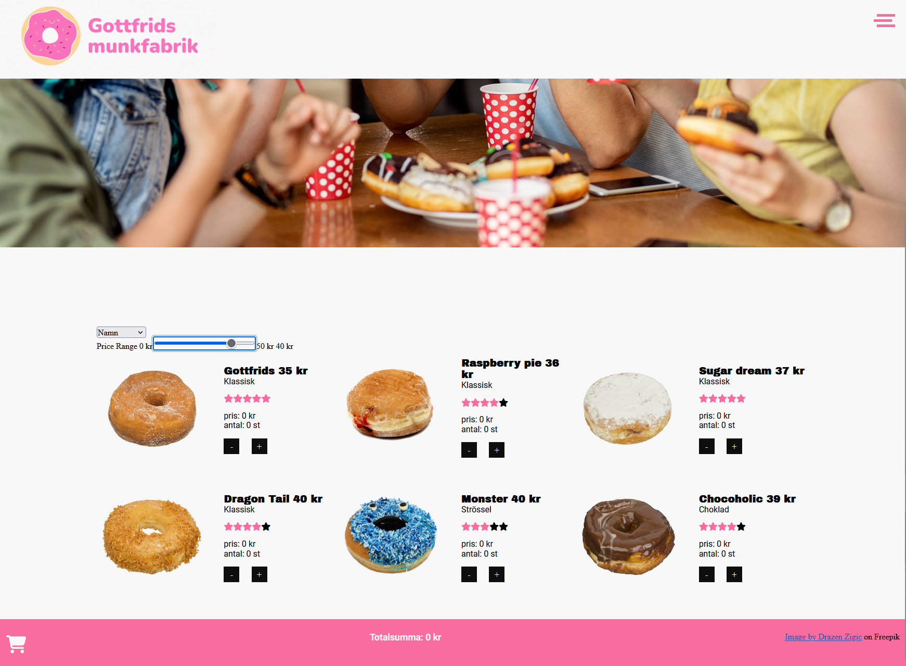
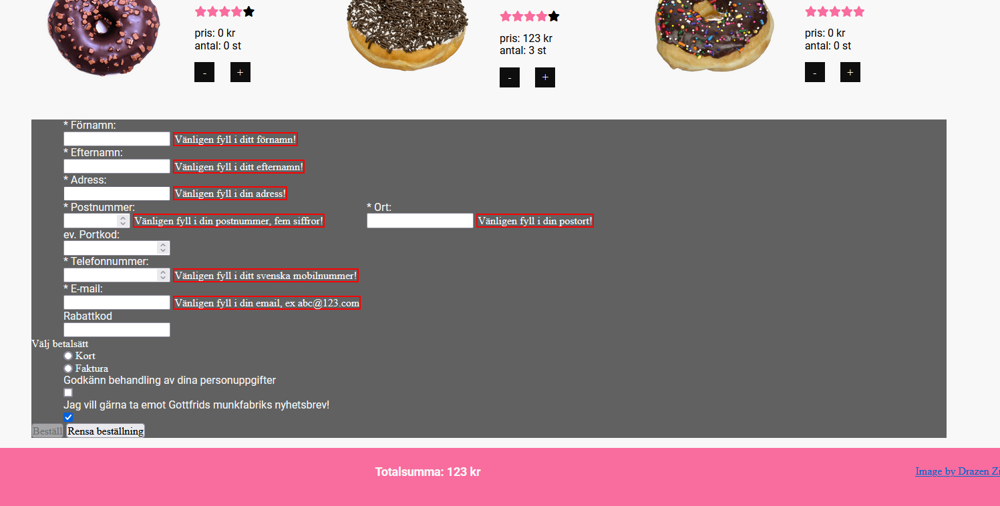
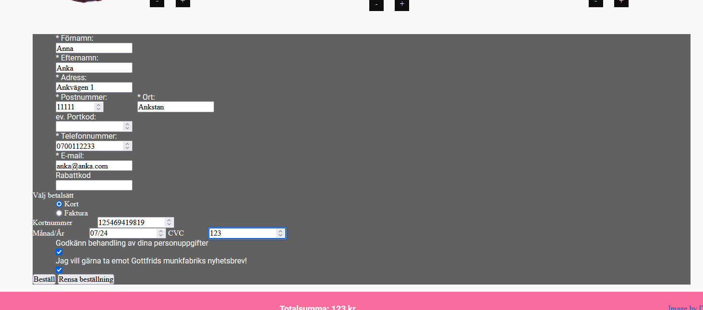
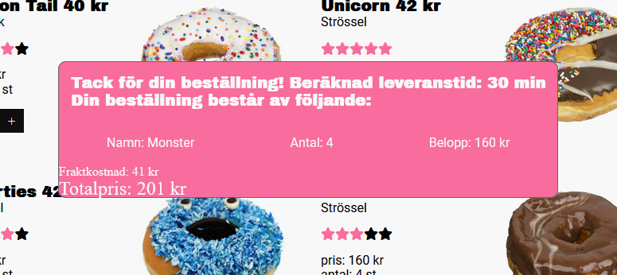
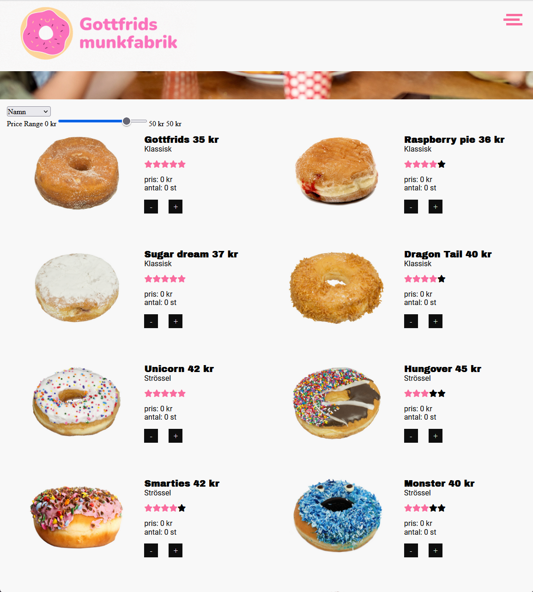
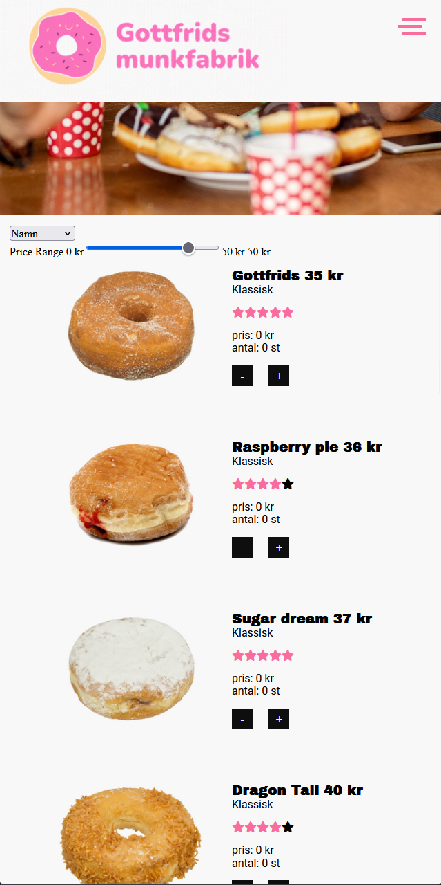

# Gottfrids munkfabrik

As a school assignment, given the Front End developer class of Medieinstitutet in the fall of 2022. This project was made by a group of students who named their group "Office hours" since that was their preferred hours of working.

The project was to create a web shop selling donuts. There was a bunch of special requirement of the made up customer, Gottfrid, that needed to be met in different ways. The project was executed during the first four weeks of the JavaScript course and the students were mainly beginners in JavaScript. 

## Authors

- [@arnetzlinder](https://www.github.com/arnetzlinder)
- [@K3mp3](https://www.github.com/K3mp3)
- [@SamuelZainali](https://www.github.com/SamuelZainali)
- [@jennifers](https://www.github.com/jennifers)

## Screenshots

 - This is a picture of the first page
 - This is the second page, the donut overview
 - A picture on the name sorting, you can also sort on rating, category, price high and low.
 - When you order, the shopping cart price bounces and changes color. The shopping cart that tells you whatdonuts you've ordered is there aswell.
 - picture of price filtering
 - when you click order, the order form appear. It needs to be filled in properly to work
 - order form filled in properly
 - When you order, a popup appear to tell you the delivery time and what youve ordered.
 - When on tablet view
 - When on cellphone view

## Tech Stack

- HTML 
- CSS
- JavaScript
- Prettier
- ESlint

## Color Reference

| Color             | Hex                                                                |
| ----------------- | ------------------------------------------------------------------ |
| $primaryColor |  #f8f8f8 |
| $secondaryColor |  #f96c9e |
| $textColor |  #0e0e0e |

